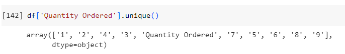
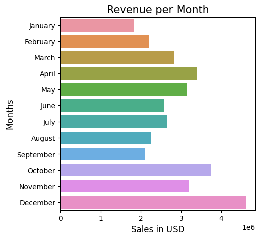
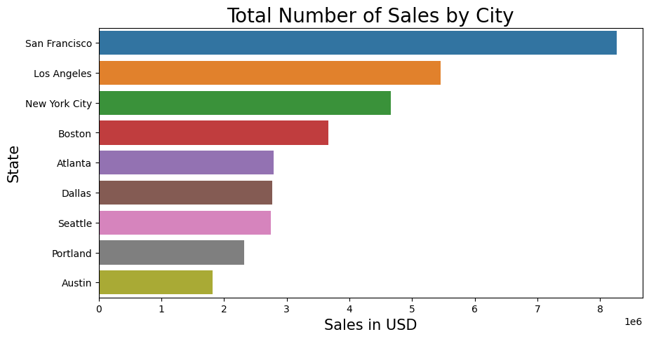
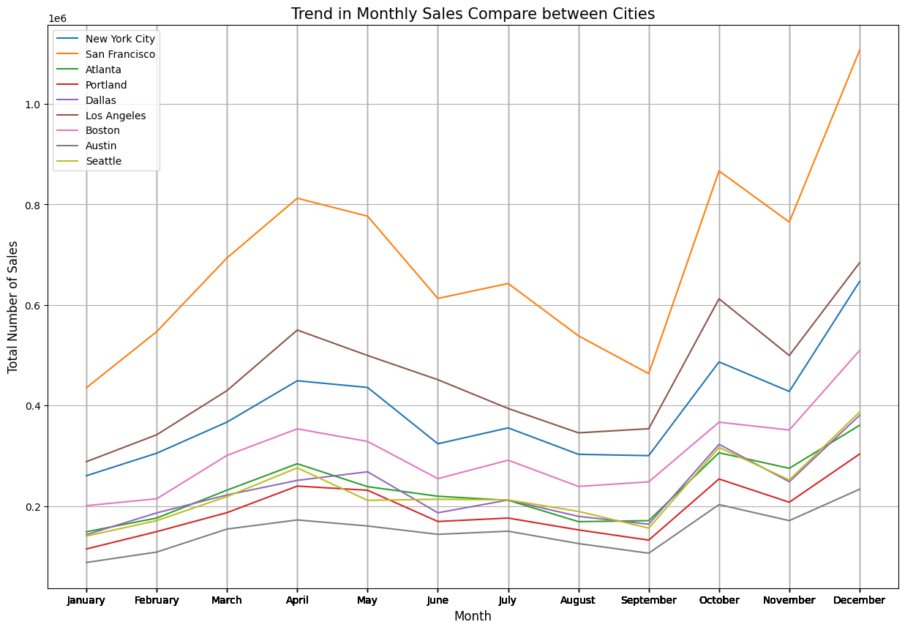
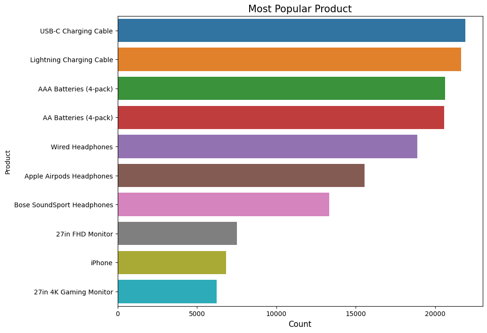
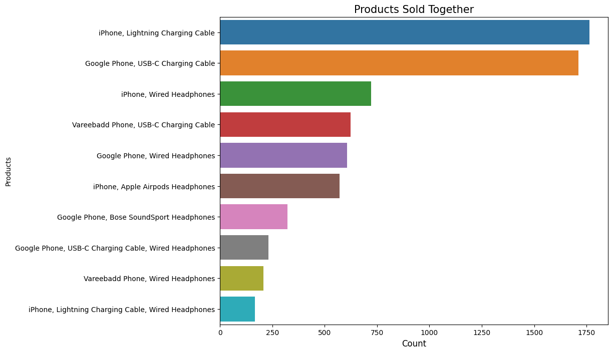

# EDA-on-Sales-Data

    

## Motivation
This is an exploration of sales data. Every business has transactions, but not everyone knows what to do with the data. With Order ID, Product	Quantity, Ordered, Price Each,	Order Date, Purchase Address, we can show trends.

## Data Cleanup
There are 10 files, and by concatenating each file, the columns names are merged into the rows. In addition, every columns have the same amount of missing rows. We can drop all the missing data. By using the purchase address, we can get the city and state. 

    

## Data exploration

First, we can see the total revenue per month, we noticed the sales increase in October, November, and December

    

The next analysis is to show total sales per city. San Francisco has the highest sales.

    

Next is to show total sales per city per month. We noticed the trend per city is about the same. 

    

Now, let's see the popular items. The most popular item is the USB-C Charging Cable following is the Lighting Charging Cable.

    

Are there any products that sold together? The order id column takes multiple items and consider it as one order. By grouping the product and order column, we can get a sense of what items are bought together. The most popular items boought together are iPhone and Lighting Charging Cable.

    

